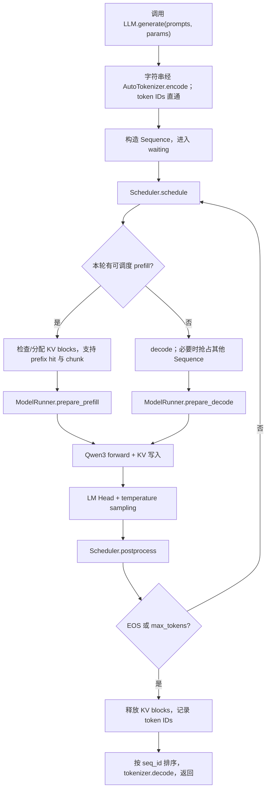
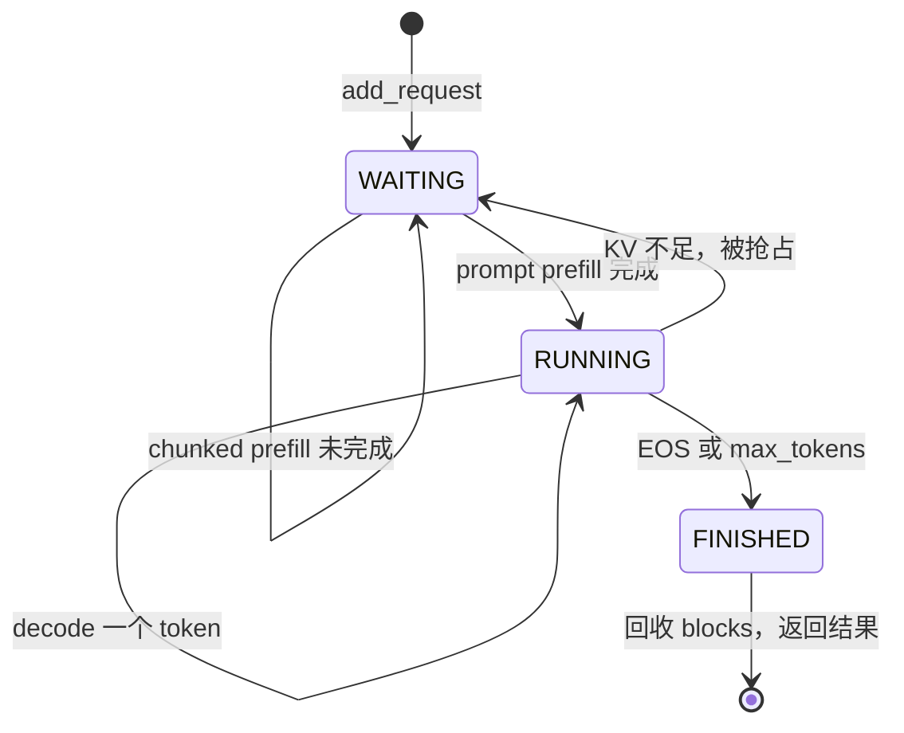
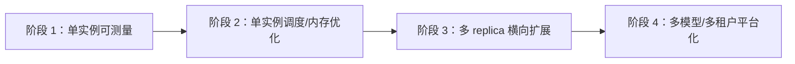

# Nano-vLLM 项目深度解析（高级后端 / AI Infra 面试宝典）

> 适用源码版本：当前仓库 `main`，提交 `031f7b0`（`Initial commit`；仓库历史已重建）。
> 分析边界：本文只依据仓库内源码、`README.md`、`pyproject.toml`、示例与基准脚本，不把上游 vLLM 的能力默认算作本项目能力。  
> 阅读标记：**源码事实**表示代码直接证明；**工程推导**表示从实现可确定地推出；**改造建议**表示面向生产化的方案，而非现有能力。凡无法确认处统一写明：**需要进一步确认，源码中无法证明。**

## 面试前先记住的结论

Nano-vLLM 不是传统 Web 后端，也不是一个完整的在线模型服务。它是一个约 1,500 行 Python 的、面向 Qwen3 和 NVIDIA GPU 的**离线大模型推理引擎内核**。它把高吞吐推理最关键的机制压缩在很小的代码面内：continuous batching、chunked prefill、paged KV cache、prefix cache、抢占重算、FlashAttention、CUDA Graph、Torch Compile 和单机多卡 Tensor Parallel。

面试时最值得讲的不是“调用了 PyTorch”，而是下面三组矛盾如何被解决：

1. **吞吐与延迟**：调度器把不同请求动态拼成批次，但 prefill 优先策略又可能牺牲 decode 延迟。
2. **显存容量与复用效率**：KV Cache 被切成固定块，用块表实现非连续分配，用哈希和引用计数复用完整前缀；不足时释放低优先级序列并重算。
3. **通用性与极简性**：只实现 Qwen3、温度采样和本机 NCCL，换来极高可读性；代价是缺少在线服务、可观测性、测试、容错和广泛模型兼容。

---

## 一、项目简介

### 1.1 项目定位

**源码事实**：`README.md:9-17` 将项目定义为 “A lightweight vLLM implementation built from scratch”，目标是快速离线推理、可读实现，以及前缀缓存、张量并行、Torch 编译、CUDA Graph 等优化。包元数据也将其描述为 lightweight vLLM implementation（`pyproject.toml:5-20`）。

因此它的准确定位是：

- 一个 Python 库形态的 LLM 推理引擎；
- 一个用于理解 vLLM 核心机制的精简参考实现；
- 一个面向本机 NVIDIA GPU、当前仅落地 Qwen3 架构的离线批量生成工具；
- 不是训练框架，不负责反向传播；
- 不是在线 Serving 系统，仓库中没有 HTTP/gRPC、鉴权、限流、租户、SLA 或部署控制面。

### 1.2 解决什么问题

自回归大模型推理的主要资源矛盾是：模型权重很大、每个请求还会随上下文增长占用 KV Cache；请求长度不同，静态批处理容易产生 padding 浪费；逐请求执行又无法充分利用 GPU。

项目通过以下机制解决：

| 问题 | 当前方案 | 直接证据 |
|---|---|---|
| 不同长度请求难以高效组批 | 调度器按 `max_num_seqs` 与 `max_num_batched_tokens` 动态组批 | `scheduler.py:25-73` |
| 长 prompt 一次占满 token 预算 | 允许队首请求 chunked prefill | `scheduler.py:42-52` |
| KV Cache 连续分配造成碎片 | 固定大小 block + 每序列 block table | `block_manager.py:26-33`、`sequence.py:55-65` |
| 相同系统提示词重复计算 | 对完整前缀块做链式哈希并共享物理块 | `block_manager.py:58-92` |
| 显存不足 | 抢占序列，释放块，之后重新 prefill | `scheduler.py:57-79` |
| decode kernel launch 开销高 | 为常见 batch size 捕获 CUDA Graph | `model_runner.py:195-212,222-257` |
| 单卡放不下或算力不足 | 单机多进程 Tensor Parallel | `llm_engine.py:22-31`、`linear.py`、`embed_head.py` |

### 1.3 核心业务与用户

这里的“业务”不是订单或内容业务，而是**将一批 prompt 转成 completion**：加载本地模型与 tokenizer，接收字符串或 token ID，调度 prefill/decode，逐 token 采样，最后解码返回。

可能用户可从源码与 README 推出：

- 想学习 LLM 推理引擎实现的工程师；
- 需要轻量离线批量推理的开发者；
- 研究调度、KV Cache、TP 等机制的 AI Infra 候选人。

真实生产用户画像、使用规模、SLA、成本目标、线上案例：**需要进一步确认，源码中无法证明。**

### 1.4 为什么需要这个系统

直接使用 Hugging Face 逐请求 `generate` 难以展示并控制上述系统级优化；完整 vLLM 又有较高理解成本。Nano-vLLM 的价值是保留高性能推理的关键闭环，同时让入口、调度、缓存、执行、模型层都能在小型代码库内读完。README 给出的单一基准中 Nano-vLLM 为 1434.13 token/s、vLLM 为 1361.84 token/s（`README.md:46-61`），但这只是特定 RTX 4070 Laptop、Qwen3-0.6B、256 请求配置，不能外推为普遍更快。

---

## 二、整体架构

### 2.1 文字版架构图

```text
调用方 Python 进程
  └─ LLM.generate / add_request + step
       ├─ Hugging Face AutoTokenizer
       ├─ Scheduler
       │    ├─ waiting / running 双队列
       │    └─ BlockManager
       │         ├─ 物理 KV block 池
       │         ├─ Sequence.block_table
       │         └─ 前缀 hash -> block_id
       └─ ModelRunner(rank 0, GPU 0)
            ├─ 输入与块表准备
            ├─ Qwen3ForCausalLM
            │    └─ Embedding -> N×(Attention -> MLP) -> LM Head
            ├─ FlashAttention / Triton KV 写入 / Torch Compile / CUDA Graph
            ├─ Sampler
            └─ SharedMemory + Event 派发
                 └─ ModelRunner(rank 1..N-1, GPU 1..N-1)
                      └─ NCCL collective 完成 Tensor Parallel
```

这不是 Client → Gateway → Controller → DB 的分层。其控制面在 CPU：请求状态、调度、块分配；数据面在 GPU：张量计算、KV 读写和采样。两者通过 `Sequence` 元数据、`block_table`、`slot_mapping` 和 `Context` 衔接。

### 2.2 各层职责与依赖方向

| 层 | 主要文件 | 职责 | 依赖方向 |
|---|---|---|---|
| 公共 API | `nanovllm/__init__.py`、`llm.py`、`llm_engine.py` | 初始化引擎、tokenize、收请求、循环 step、还原顺序和 decode | 向下依赖配置、调度、执行器 |
| 控制面 | `config.py`、`sequence.py`、`scheduler.py`、`block_manager.py` | 配置、状态机、批调度、KV 块生命周期与前缀复用 | 不依赖具体 Qwen3 数学层；调度器依赖块管理器 |
| 执行面 | `model_runner.py`、`utils/context.py`、`utils/loader.py` | 多进程协调、输入张量构造、模型执行、KV 容量计算、CUDA Graph | 向下依赖模型和 layers |
| 模型 | `models/qwen3.py` | 按 Qwen3 配置组装 Transformer、定义权重打包映射 | 依赖通用算子层 |
| 算子 | `layers/*` | TP Linear/Embedding、Attention、RoPE、RMSNorm、SwiGLU、采样 | 依赖 PyTorch、Triton、FlashAttention、NCCL |

依赖大体由 API → Engine → Model → Layer 单向下沉；但 `layers` 通过全局 `Context` 获取调度生成的执行元数据，这是为了少传参数而引入的隐式耦合。

### 2.3 为什么这样拆

- 调度器不理解 Qwen3 权重细节，使请求策略和模型计算相对隔离。
- `BlockManager` 单独维护 CPU 侧块元数据，便于把显存视为资源池，而不是让模型层决定内存生命周期。
- 模型结构与通用 TP/Attention 算子分离，理论上可以新增模型组装层并复用算子；但 `ModelRunner` 目前直接导入 `Qwen3ForCausalLM`，扩展点还没有抽象完成（`model_runner.py:9,31`）。
- `ModelRunner` 同时承担进程协调、显存规划、张量准备、图捕获和执行，代码短，但已经是职责最重、最容易继续膨胀的类。

### 2.4 最核心的模块

1. **Scheduler**：决定每轮 GPU 做什么，直接影响吞吐、公平性和首 token/逐 token 延迟。
2. **BlockManager + Sequence**：决定 KV Cache 是否能高效分配、复用和回收。
3. **ModelRunner**：把 CPU 调度结果翻译为 GPU 可执行张量，并承载 eager/CUDA Graph 与 TP 协调。
4. **Attention**：真正消费 paged KV cache；若块表、slot mapping 与这里不一致，会产生静默错误或越界。

### 2.5 模块如何通信

- API → Scheduler：同进程直接方法调用，`Sequence` 作为请求实体。
- Scheduler → rank 0 ModelRunner：同进程直接调用。
- rank 0 → 其他 rank：1 MiB 固定命名共享内存写入 pickle 数据，`Event` 通知（`model_runner.py:41-89`）。
- GPU 间：NCCL；Row Parallel 使用 `all_reduce`，词表 embedding 使用 `all_reduce`，LM Head 使用 `gather`（`linear.py:152-156`、`embed_head.py:34-65`）。
- 执行准备 → layers：进程内全局 `Context`，一次 run 后 reset（`context.py`、`model_runner.py:214-220`）。

### 2.6 设计模式判断

| 模式 | 是否采用 | 判断 |
|---|---|---|
| Pipeline | 是 | tokenize → schedule → prepare → model → sample → postprocess → decode 是明确流水线 |
| Facade | 是 | `LLM`/`LLMEngine.generate` 屏蔽多进程、调度和 GPU 细节 |
| Scheduler / Resource Manager | 是 | `Scheduler` 决策，`BlockManager` 管理有限显存块 |
| Flyweight / 共享对象思想 | 部分 | 相同完整前缀块以引用计数共享物理 KV block |
| State Machine | 简化采用 | `WAITING → RUNNING → FINISHED`，抢占时 `RUNNING → WAITING` |
| Strategy | 未完整采用 | prefill 优先、抢占与采样策略均硬编码，没有策略接口 |
| Factory | 仅有函数级 | `get_rope()` 是带缓存的构造函数；模型没有注册工厂 |
| MVC / DDD / Repository / Clean Architecture / Hexagonal | 否 | 没有 UI/Controller、领域仓储或端口适配器边界；这是计算引擎，不应硬套业务架构 |
| Observer / Chain of Responsibility / Builder | 否 | 源码没有对应结构 |

面试表达应是：“它采用了控制面/数据面分离和流水线式模块化，但不是严格 Clean Architecture；全局 Context、ModelRunner 直连 Qwen3 说明边界仍偏实用主义。”

---

## 三、目录结构解析

```text
nano-vllm/
├── README.md / pyproject.toml       # 定位、安装、依赖与发布元数据
├── example.py / bench.py            # 使用示例与单场景吞吐脚本
├── nanovllm/
│   ├── __init__.py / llm.py         # 极薄公共入口
│   ├── config.py                    # 引擎配置与 HF 配置加载
│   ├── sampling_params.py           # 最小采样参数
│   ├── engine/                      # 控制面与执行编排
│   │   ├── llm_engine.py
│   │   ├── sequence.py
│   │   ├── scheduler.py
│   │   ├── block_manager.py
│   │   └── model_runner.py
│   ├── models/qwen3.py              # 唯一模型结构
│   ├── layers/                      # 高性能与 TP 算子
│   └── utils/                       # 执行上下文、权重加载
└── assets/                          # README 图片
```

### 3.1 为什么这样划分

`engine` 负责“何时算、算哪些请求、内存给谁”；`models` 负责“网络由哪些层组成”；`layers` 负责“每层怎样高效计算”；`utils` 放跨层辅助。这个划分符合推理引擎的天然边界，比 Controller/Service/DAO 更合适。

### 3.2 重要性与修改风险

| 目录/文件 | 重要度 | 不要轻易修改的原因 |
|---|---:|---|
| `engine/scheduler.py` + `block_manager.py` + `sequence.py` | 最高 | 三者共同维护 `num_tokens`、`num_cached_tokens`、`num_scheduled_tokens`、块表和 ref count 不变量，局部改动可能导致 KV 错位 |
| `engine/model_runner.py` + `layers/attention.py` | 最高 | `slot_mapping`、`block_tables`、sequence length 必须逐 token 对齐；错误可能不是显式异常，而是生成结果错误 |
| `layers/linear.py` + `embed_head.py` + `utils/loader.py` | 高 | 权重分片、packed 权重映射与 collective 必须一致，否则多卡数值错误或死锁 |
| `models/qwen3.py` | 高 | 参数名必须和 safetensors/HF 配置匹配 |
| `config.py` | 中高 | 多项参数决定图形状和缓存容量，缺少统一跨字段验证 |
| `example.py` / `bench.py` | 低 | 不在运行核心，但 benchmark 口径会影响性能结论可信度 |

### 3.3 容易形成技术债的位置

- `ModelRunner` 已同时负责 IPC、分布式、模型生命周期、显存规划、输入构造和 CUDA Graph，应优先拆分。
- `Context` 是可变进程全局变量；单线程串行很简洁，但阻碍并发、多模型和可重入测试。
- 模型注册缺失，新增架构必须修改 `model_runner.py`。
- 根目录没有 `tests/`、`.github/workflows/`、锁文件或文档目录；回归与可复现性薄弱。
- `.gitignore` 是通用模板且内容远多于项目所需，不是运行风险，但反映项目工程治理较轻。

---

## 四、一次生成请求的完整链路

本项目没有 HTTP 接口，因此选择公开的 `LLM.generate()` 作为“典型接口”。不要在面试中虚构 Router、Middleware、Controller。



### 4.1 初始化阶段

`LLM` 只是 `LLMEngine` 的空子类（`llm.py`）。初始化时：

1. 从 kwargs 中只筛 `Config` 字段，构建配置并读取本地 HF config（`llm_engine.py:17-21`、`config.py:20-25`）。未知 kwargs 会被静默忽略，这是易用但危险的行为。
2. 设定全局 `Sequence.block_size`。
3. 使用 `spawn` 为 rank 1..N-1 创建进程，rank 0 留在主进程（`llm_engine.py:22-31`）。
4. 每个 rank 初始化 NCCL、绑定同号 GPU、创建 Qwen3、加载 safetensors、warmup、按剩余显存分配 KV Cache，按配置捕获 CUDA Graph（`model_runner.py:17-39`）。
5. rank 0 加载 tokenizer，把 EOS 写回 Config，再构建 Scheduler。这个顺序保证调度器拿到实际 EOS 和 rank 0 计算出的 KV block 数（`llm_engine.py:31-35`）。

失败处理：几乎全部是 `assert` 或依赖库异常，没有统一清理回滚。若某 worker 初始化失败，主进程的错误传播与其他 rank 回收机制：**需要进一步确认，源码中无法证明。**

### 4.2 接收与标准化输入

`generate()` 接受 `list[str]` 或 `list[list[int]]`。字符串通过 tokenizer 编码，token ID 列表直接使用；`Sequence` 复制 token 列表，保存 prompt 长度、温度、最大输出长度和 EOS 策略（`llm_engine.py:43-47`、`sequence.py:18-31`）。

输入/输出变化：

```text
str prompt
  -> list[int] prompt_token_ids
  -> Sequence(WAITING, block_table=[])
  -> completion_token_ids 持续 append
  -> {"text": decoded_text, "token_ids": [...]}
```

边界：空 token 列表会在 `token_ids[-1]` 处失败；prompt 未检查是否超过 `max_model_len`；采样参数列表与 prompts 数量不同时 `zip` 会静默截断（`llm_engine.py:67-70`）。

### 4.3 调度 prefill

调度器先看 `waiting`：

- 受最大序列数和最大批 token 数双重约束；
- 新序列先调用 `can_allocate`，按完整 block 前缀查缓存，并确认物理块够用；
- 除队首序列外，其他请求只有能完整放入剩余 token 预算才进入本批；队首允许 chunked prefill；
- prompt 全部 prefill 后状态变为 `RUNNING`，否则仍留 waiting 等下一轮 chunk（`scheduler.py:29-55`）。

为什么 prefill 与 decode 分开：prefill 一次处理多个 token，形状是变长序列；decode 每序列只处理最后一个 token，依赖历史 KV。分开可选不同 FlashAttention API 和 CUDA Graph 路径。

### 4.4 块分配与前缀命中

完整块的 token IDs 与前块 hash 共同计算 xxHash64，形成链式前缀身份；命中后还比较实际 token IDs，降低哈希碰撞导致错误复用的风险（`block_manager.py:35-41,58-73`）。使用中的缓存块增加引用计数；已释放但仍保留内容的块从 free deque 重新激活。查找时始终排除当前请求的最后一个逻辑块——无论它恰好完整还是部分填充——因此至少会重新计算尾部以得到 next-token logits，同时也避开部分块共享的 copy-on-write 问题。

没有数据库事务；这里的“一致性”靠单线程调度顺序、assert、ref count 和状态字段不变量维护。

### 4.5 准备 GPU 输入

Prefill 根据 `[num_cached_tokens, num_cached_tokens + num_scheduled_tokens)` 构造本轮 `input_ids` 和 position；同时构造 FlashAttention 需要的累计长度、最大长度、KV 写入 `slot_mapping`。有缓存前缀时，query 长度小于 key 上下文长度，并传 block table（`model_runner.py:129-170`）。

Decode 每序列只送 `last_token`，position 为 `len(seq)-1`，context length 为当前总长，写入位置由最后一个 block ID 与块内偏移计算（`model_runner.py:172-188`）。CPU 张量使用 pinned memory，并 non-blocking 传 GPU。

### 4.6 模型执行与采样

- Prefill、强制 eager、或 batch size > 512：直接执行模型。
- 其他 decode：向上取已捕获 batch bucket，复制到静态 buffer 后 replay CUDA Graph（`model_runner.py:195-212`）。
- Attention 先用 Triton kernel 把本轮 K/V 写入分页缓存，再选择 prefill 的 `flash_attn_varlen_func` 或 decode 的 `flash_attn_with_kvcache`（`attention.py:10-75`）。
- LM Head 在 prefill 时只取各序列最后 query 位置，避免为所有 prompt token 生成词表 logits（`embed_head.py:56-65`）。
- rank 0 将 logits 除以每请求 temperature，softmax 后用 exponential race/Gumbel-Max 等价方法采样（`sampler.py:5-12`）。

### 4.7 后处理与结束

`postprocess` 先为新完成的整块建立 hash，再推进 cached/scheduled 计数。如果 chunked prefill 尚未覆盖完整 prompt，不 append 采样结果；否则 append 一个 token。命中 EOS（且未 ignore）或 completion 数达到 `max_tokens` 时置 FINISHED、释放块并从 running 移除（`scheduler.py:81-92`）。

最终 `generate` 用全局单调 `seq_id` 排序恢复输入顺序，decode 后返回字典列表（`llm_engine.py:84-90`）。函数类型标注写的是 `list[str]`，与实际返回值不一致。

### 4.8 横切关注点

- **异常**：无统一包装，assert/第三方异常直接冒泡。
- **日志**：无结构化日志；只有 tqdm 显示最近一次 prefill/decode 吞吐。
- **事务**：不适用；所有状态在单进程内存中变更。
- **缓存**：GPU KV Cache 与 CPU 块元数据；无 Redis。
- **重试**：无错误重试；“抢占后重新 prefill”是资源调度重算，不是异常重试。
- **响应**：同步、一次性返回，不支持 token streaming。

---

## 五、核心业务流程

### 5.1 正常流程：批量自回归生成



核心循环每次只做一轮 prefill 或一轮 decode。只要本轮能调度任何 prefill，就立即返回 prefill batch；因此等待请求优先于 decode。对离线批处理，这有利于尽快把请求纳入 running、提高 GPU token 吞吐；若改成在线持续入流，则新 prompt 可能持续插队，放大已运行请求的 inter-token latency。

### 5.2 前缀缓存流程

```text
Sequence prompt
  -> 仅扫描最后一个块之前的完整块
  -> hash_i = xxhash(hash_(i-1) + token_ids_i)
  -> hash 命中且 token_ids 相同？
       是：复用 block_id，ref_count + 1 或从 free 池激活
       否：后续块全部新分配
  -> num_cached_tokens = 命中块数 × block_size
  -> prefill 只计算剩余 tokens
```

这是 exact-prefix cache，不是语义缓存。缓存粒度默认为 256 tokens，命中只可能发生在完整块边界。优点是正确性简单、无需额外存储完整 request key；缺点是短公共前缀和非块对齐尾部不能复用。

### 5.3 显存不足与抢占

Decode 准备跨入新块而 free blocks 不够时，调度器从 `running` 尾部抢占其他序列，释放其所有块；若没有其他序列，则抢占当前序列（`scheduler.py:57-69,75-79`）。被抢占序列保留完整 token IDs，状态回 WAITING，后续把 prompt + 已生成 token 当成 prefill 重新计算。

设计选择：**recompute 而不是 swap**。代码更短，不需要 CPU KV 缓存与异步搬运；但长上下文重算成本高。victim 近似选择较晚进入 running 的序列，不依据已消耗算力、剩余长度、优先级或租户公平性。

### 5.4 失败、重试、补偿、降级与幂等

| 能力 | 当前实现 | 面试判断 |
|---|---|---|
| 失败流程 | assert 或 CUDA/NCCL/加载异常直接中断 | 没有请求级隔离与恢复 |
| 重试 | 没有异常重试 | 抢占重算只解决资源不足 |
| 补偿 | 仅正常完成/抢占时释放 block | 初始化中途失败、run 中异常后的完整清理不充分 |
| 降级 | `enforce_eager=True` 可关闭 CUDA Graph | 这是兼容/调试开关，不是运行时自动降级 |
| 幂等 | `generate` 不是幂等 API；随机采样可产生不同输出 | 没有 request ID、seed 或结果去重 |
| 超时/取消 | 无 | 不能取消单个 Sequence |

GPU OOM、NCCL 超时、worker 崩溃后的具体行为：**需要进一步确认，源码中无法证明。** 从代码看没有请求级恢复机制。

---

## 六、核心模块分析

### 6.1 `LLMEngine`：门面与生命周期编排

- **为什么存在**：向用户提供接近 vLLM 的最小 API，把 tokenizer、进程、调度、执行和输出还原封装起来。
- **输入**：本地模型目录、Config kwargs、prompts、SamplingParams。
- **输出**：每 prompt 一个 `{text, token_ids}`。
- **关键算法**：生成循环不断 `schedule → run → postprocess`，按 seq ID 收集完成结果。
- **亮点**：API 极薄；也暴露 `add_request/step`，外部可自行搭更细粒度事件循环。
- **缺点**：同步阻塞、无流式输出、无并发保护；kwargs 静默过滤；采样参数长度不校验；类型标注错误；`atexit` 清理无法代替显式 context manager。
- **扩展**：增加 async engine、streaming iterator、request handle/cancel、输入校验与显式 `close()`。
- **10 倍规模先改**：把接入层与单 GPU engine 解耦，做多实例路由，而不是让一个 Python 对象承接所有并发。

### 6.2 `Sequence`：请求状态实体

- **为什么存在**：把 prompt、生成 token、状态、采样参数、缓存进度和块表聚合为调度单位。
- **关键数据**：`seq_id`、`status`、`token_ids`、三类 token 计数、`block_table`、采样参数。
- **关键不变量**：`num_completion_tokens = num_tokens - num_prompt_tokens`；`num_cached_tokens + num_scheduled_tokens` 描述本轮执行边界；block table 必须覆盖当前需写入的所有 token。
- **亮点**：自定义 pickle 状态在 decode 时只传 last token，减少 rank 间 IPC 数据量（`sequence.py:72-83`）。
- **缺点**：默认参数 `SamplingParams()` 在定义时实例化；当前虽未修改它，但风格上有共享默认对象风险。空输入未校验。类变量 block size 使多引擎不同块大小共存不安全。worker 侧反序列化对象只有部分字段，强依赖“worker 只读特定字段”的隐式约定。
- **扩展**：不可变 request spec + 独立 mutable runtime state；增加 deadline、priority、tenant、cancel flag、seed。

### 6.3 `Scheduler`：吞吐与公平性的决策中心

- **为什么存在**：GPU 高效需要动态批处理；显存有限又要求准入、抢占和回收。
- **输入**：waiting/running sequences、token/序列预算、block 可用性。
- **输出**：本轮 sequences 与 `is_prefill`。
- **算法**：prefill-first FIFO；队首 chunk；decode 每序列一步；KV 不足时尾部 victim recompute。
- **亮点**：用不到 100 行代码串起 continuous batching、chunked prefill 与 preemption；资源判断委托 BlockManager。
- **缺点**：没有优先级、公平性、SLA 与自适应 prefill/decode 配额；等待流量可饿死 decode；`assert scheduled_seqs` 在极端无块可调度场景可能把可恢复资源压力变成崩溃；超大请求永远不能分配完整 block table 时无明确拒绝。
- **扩展**：策略接口（FCFS、priority、deadline、weighted fair）；每轮混合/配额调度；admission control；基于代价的 victim 选择。
- **面试追问点**：为什么最后抢占？为什么不 swap？chunked prefill 为什么只允许队首？如何兼顾 TTFT 与 TPOT？

### 6.4 `BlockManager`：分页 KV 与前缀缓存元数据

- **为什么存在**：把 GPU KV 内存抽象成固定块，实现非连续分配、共享和回收。
- **输入/输出**：Sequence token/块状态 → 可命中块数、block table、可否 append。
- **数据结构**：`blocks[]` O(1) 定位；`free_block_ids` deque；`used_block_ids` set；`hash_to_block_id` dict；每块 ref count/hash/token IDs。
- **算法**：链式 xxHash64 + token IDs 二次验证；完整块建立索引、查找时排除请求最后一个逻辑块；引用计数共享；free block 保留 hash 直到被覆盖。
- **亮点**：缓存与空闲池统一，不另占一份 KV 显存；已完成请求的 KV 块虽然 free，但内容仍可命中；碰撞校验保护正确性。
- **缺点**：只维护一个 hash 对应一个 block，重复内容的多副本不会被统一；没有显式 LRU、命中率/驱逐指标；CPU 保存每个缓存块 token list 有内存开销；`numpy.array(token_ids)` 未固定 dtype，跨平台 hash 稳定性不是对外协议但不够显式；引用计数正确性主要靠 assert。
- **10 倍规模先改**：指标化命中/驱逐，radix tree 或更细粒度前缀结构，按租户配额，缓存感知调度；block size 做基准后可配置，而非只断言 256 的倍数。

### 6.5 `ModelRunner`：CPU/GPU 桥梁

- **为什么存在**：将 Sequence 元数据转为紧凑 GPU 张量，管理模型、KV、执行模式和 TP worker。
- **输入**：scheduled sequences、prefill/decode 标志。
- **输出**：rank 0 采样 token IDs。
- **关键数据结构**：共享内存 command、pinned tensors、全局 Context、KV cache 大张量、CUDA graph bucket 和静态 buffers。
- **关键算法**：warmup 估算峰值；按剩余显存计算 block 数；prefill/decode 两套输入构造；decode graph replay。
- **亮点**：把 paged KV 所需的 block table/slot mapping 与 FlashAttention 对齐；只在 prefill 最后位置生成 logits；图 bucket 控制图数量与 padding 开销。
- **缺点**：职责过多；共享内存固定名 `nanovllm`、固定 1 MiB、NCCL 固定端口 2333，不支持同机多实例安全隔离；无 worker ack、超时、健康检查和错误回传；GPU rank 假设等于设备号；只支持单机；每 step 重建多个 CPU/GPU 小张量。
- **扩展**：IPC/ProcessGroup、MemoryPlanner、InputBuilder、GraphRunner 拆类；唯一 rendezvous 地址与 shm 名；command header 加长度上限、request ID、错误槽和 ack。

### 6.6 Qwen3 模型与算子层

- **为什么存在**：不依赖 Transformers 的 eager model forward，而是重建更适合 paged KV 与 TP 的网络。
- **输入/输出**：token IDs + positions → hidden states → vocab logits。
- **关键结构**：QKV fused projection、GQA、Q/K RMSNorm、RoPE、Attention、SwiGLU MLP、残差融合 RMSNorm、并行 LM Head。
- **TP 方式**：Column Parallel 切输出维且局部计算；Row Parallel 切输入维后 all-reduce；embedding 按词表切分后 all-reduce；head logits gather 到 rank 0。
- **权重加载**：Q/K/V 和 gate/up 的独立 HF 权重装入合并参数；各 loader 按 rank 切 shard（`qwen3.py:186-193`、`loader.py`、`linear.py`）。
- **亮点**：算子与模型组装分离；packed projection 减少 kernel/参数管理开销；RMSNorm 与 residual add 融合；RoPE cache 和多处 `torch.compile`。
- **缺点**：仅支持 Qwen3；模型选择硬编码；量化、LoRA、speculative decoding、beam search 不存在；词表大小和 head 数要求能被 TP size 整除；采样先构建全量 softmax 概率，超大词表有带宽与显存临时开销。
- **扩展**：模型注册表 + architecture adapter；量化 linear；更完整 sampler；多模态输入需要新 model/input contract。

### 6.7 `Context` 与 Loader

`Context` 避免把十余个 attention 元数据沿 `model → decoder layer → attention` 层层传递，代码极简；代价是隐式依赖、非线程安全、异常时若未 reset 可能残留状态。Loader 通过 parameter 上挂 `weight_loader` 函数实现每种并行参数自己的加载策略，这是轻量的 Strategy 思想；但没有缺失/多余权重校验摘要、格式抽象和错误上下文。

---

## 七、数据库设计

### 7.1 结论

项目没有数据库、ORM、Repository、数据表、索引或数据库事务。对离线推理库而言这是合理的：请求只在一次进程生命周期内存在，模型权重来自本地 safetensors，输出直接返回调用者。不要为了套后端模板把 `Sequence` 叫“数据库实体”。

主要表、关系、索引、冷热数据、分库分表、历史表、软删除、版本号、乐观锁：**均不适用当前源码**。生产部署是否由外围系统落库：**需要进一步确认，源码中无法证明。**

### 7.2 可类比但不能混淆的内存模型

若面试官问“没有 DB，状态放哪”，可回答：

| 内存对象 | 类比职责 | 生命周期 |
|---|---|---|
| `waiting` / `running` deque | 请求工作队列 | Engine 进程内 |
| `Sequence` | 请求运行态 | 请求加入到完成；完成 token 被 `generate` 临时收集 |
| `blocks[]` / block table | KV 物理页与页表 | Engine 生命周期；映射随请求变化 |
| `hash_to_block_id` | 前缀索引 | Engine 生命周期，block 被覆盖时失效 |
| 模型权重 | 只读主数据 | ModelRunner 生命周期 |

这套状态机没有持久化与 WAL。进程退出后请求和 KV 全部丢失，符合离线库定位，不符合需要故障恢复的在线服务要求。

### 7.3 事务与一致性

状态变更在主进程单线程调度路径中顺序执行，没有数据库事务。关键一致性靠操作顺序：先确认容量再 allocate；完成或抢占时逐块 ref count--；归零才回 free pool；postprocess 在 append 新 token 前先推进本轮缓存状态。

风险在于这些不是异常安全事务：allocate 到一半、模型执行失败、用户中断时，没有 `try/finally` 将调度与 block 状态回滚。生产化可用“调度计划先构造、commit 后变更状态”或 request-scoped resource guard 提升异常安全性。

---

## 八、缓存设计

### 8.1 没有 Redis，实际缓存是什么

源码没有 Redis 客户端、Redis key、TTL 或集群配置。本项目的缓存是 GPU 上的 **KV Cache**，以及 CPU 上用于管理它的 block metadata。Redis 并不适合直接承载每层每头的大规模 GPU KV 张量：网络传输与序列化成本会抵消复用收益，且每个 decode token 都依赖低延迟读取。

### 8.2 KV Cache 布局

`allocate_kv_cache` 创建形状：

```text
[2, num_hidden_layers, num_kvcache_blocks, block_size,
 num_kv_heads_per_rank, head_dim]
```

首维 2 表示 K/V。每块字节数为：

```text
2 × layers × block_size × kv_heads_per_rank × head_dim × dtype.itemsize
```

可用块数按 `total × gpu_memory_utilization - 已用 - warmup峰值 + 当前占用` 除以上式得到（`model_runner.py:103-115`）。这里利用 warmup 获得非 KV 推理峰值，为模型和临时张量预留空间。

### 8.3 “Key” 设计

前缀索引不是字符串 key，而是链式 64 位 hash：

```text
H0 = xxhash(tokens_of_block_0)
H1 = xxhash(H0 || tokens_of_block_1)
...
hash_to_block_id[Hi] = physical_block_id
```

加入前序 hash 可区分“相同局部 token 块、不同上文”的 KV，因为同一 token 的 K/V 受位置和上文影响。命中后再比较当前块 token IDs；但只比较该块 token，加上链式 hash 仍依赖前链 hash 的碰撞概率。xxHash 是速度优先的非密码哈希，这里用于进程内缓存索引是合理取舍。

### 8.4 TTL、淘汰与一致性

- **TTL**：没有时间 TTL。缓存内容保留到物理块被重新分配覆盖。
- **淘汰**：free deque 的块被 `_allocate_block()` 取出时覆盖，并删除仍指向它的 hash 映射。它近似按释放/进入 free 队列顺序回收，但不是严格 LRU，因为没有最后访问时间。
- **一致性**：block 内容只有完整计算后才 hash；引用计数防止共享块仍被使用时回收到 free；重新分配前清理旧 hash。
- **缓存粒度**：完整 block，默认 256 token；复用扫描排除请求最后一个逻辑块。即使 prompt 长度恰好为 block size 的整数倍，最后一块也要重算以产出 next-token logits。

### 8.5 击穿、穿透、雪崩的对应关系

传统 Redis 三问题不能原样套用，但可做工程类比：

- **穿透**：大量从不重复的 prompt 都 miss，退化为正常 prefill，不会访问数据库；代价是 GPU 计算与 KV 占用。
- **击穿**：热门长前缀刚被覆盖后大量相同请求到达，会重复 prefill。当前没有 singleflight，但同批并发相同前缀在第一份尚未完整 hash 前也无法命中。
- **雪崩**：没有 TTL 同时过期；但缓存池压力导致大量块被覆盖/大量序列被抢占，会形成重算风暴。

生产改造应观测 prefix hit tokens、block hit rate、eviction、preemption、recompute tokens；再考虑缓存感知调度、为热门前缀 pin 块、租户配额或 radix-tree prefix cache。

---

## 九、消息队列设计

### 9.1 结论

项目没有 Kafka、RabbitMQ、Pulsar 等外部 MQ，也没有持久消息、消费者组、offset、死信队列。`deque` 是进程内调度队列，不具备 MQ 的持久化和跨服务语义；multiprocessing Event + SharedMemory 是 worker 命令 IPC，也不是业务消息队列。

消息内容、重复消费、顺序消费、失败重投：**不适用当前源码**。线上系统是否在引擎外接 MQ：**需要进一步确认，源码中无法证明。**

### 9.2 为什么不用 Kafka

核心执行是 token 级、低延迟、强 GPU 内存亲和的循环。把每个调度 step 或 token 放 Kafka 会引入序列化、网络/磁盘和消费协调开销，而且 Sequence 与 KV block 强绑定本 GPU，不能被任意 consumer 接管。当前进程内 deque 和共享内存更匹配单机数据面。

若未来做异步离线作业平台，Kafka 可以放在**引擎之外**承接作业提交、削峰和结果事件；进入某个 GPU worker 后仍应使用本地调度器。作业需有 request ID、幂等结果表、租约、重试次数和 DLQ，不能直接把现有 Sequence pickle 当稳定消息协议。

---

## 十、配置体系

### 10.1 配置来源与优先级

配置有三层：

1. `Config` dataclass 默认值：批 token 16384、最大序列 512、最大模型长度 4096、显存利用率 0.9、TP=1 等（`config.py:6-18`）。
2. `LLM(model, **kwargs)` 中与 Config 字段同名的显式参数覆盖默认值（`llm_engine.py:17-20`）。
3. 模型目录的 Hugging Face config 提供架构、dtype、最大位置等；用户 `max_model_len` 会被 `max_position_embeddings` 上限截断（`config.py:24-25`）。运行时 warmup 后，rank 0 根据 GPU 状态写入 `num_kvcache_blocks`。

可概括为：`代码默认 < 显式 kwargs`，但模型 config 对架构参数是权威，且对最大长度施加上限；GPU 探测决定最终 KV 容量。

### 10.2 已有校验

- 模型路径必须是目录；
- KV block size 必须是 256 的倍数；
- TP size 在 1..8；
- Sampling temperature 大于极小正数，明确不允许 greedy；
- KV blocks 必须大于 0；
- head、KV head、vocab 与 TP 分片处各有整除 assert。

### 10.3 缺失能力与风险

- 没有环境变量、配置文件、CLI、远端配置中心或 Feature Flag；
- 没有热更新；所有图、缓存和进程都在初始化时按配置固定；
- 未知 kwargs 静默丢弃，拼写错误不报错；
- 大量使用 `assert` 做用户输入验证，Python `-O` 可移除 assert；
- 缺少跨字段校验，如 prompt/model 长度、TP 与可见 GPU 数、CUDA graph bucket 覆盖、共享内存最大 payload；
- `num_kvcache_blocks` 虽是 Config 字段，却会被运行时强制重算，调用者传值实际上不会保留，这是接口语义不清。

Feature Flag 与配置热更新是否由外部系统提供：**需要进一步确认，源码中无法证明。**

### 10.4 生产化建议

用不可变 `EngineConfig` 完成解析和全量验证；未知参数 fail-fast；将静态配置（模型、TP、block size）与动态策略配置（调度权重、队列阈值）分开。动态策略只能在 step 边界原子替换；影响 tensor shape/KV layout 的配置不得热更，必须滚动重启。

---

## 十一、日志与可观测性体系

### 11.1 当前实现

核心包没有 `logging`、TraceID、RequestID、审计日志或 metrics exporter。`generate` 使用 tqdm 展示最近一步估算的 prefill/decode tok/s（`llm_engine.py:66-87`），`bench.py` 用 `print` 输出总吞吐。这不是生产可观测性体系。

README 的 benchmark 只报告 output token throughput，没有 TTFT、TPOT、P50/P95/P99、显存峰值、batch 分布、prefix hit、抢占次数或错误率。其 total token 之所以准确，是 benchmark 设置 `ignore_eos=True`，每请求必然生成 max tokens（`bench.py:17-28`）。

### 11.2 应补的三类信号

| 类型 | 建议字段/指标 |
|---|---|
| Logs | `request_id/seq_id`、模型、prompt/output tokens、enqueue/start/end、finish reason、异常栈、rank、graph/eager 路径 |
| Metrics | queue depth、running seqs、batch tokens、TTFT、TPOT、吞吐、KV 使用率、prefix hit tokens、preemption/recompute、CUDA OOM、NCCL error |
| Traces | enqueue → schedule wait → prefill chunks → decode steps → detokenize；跨接入层/engine worker 传播 trace context |

审计日志只在涉及租户、计费、内容策略或管理操作时需要；当前离线库没有这些业务。生产部署的日志采集与监控平台：**需要进一步确认，源码中无法证明。**

### 11.3 TraceID 与 seq ID 的区别

`Sequence.counter` 产生进程内单调 seq ID，可用于本地关联，但它不是全局唯一 RequestID，重启后重新从 0 开始，也不跨服务。生产中应由入口注入 request ID/traceparent，并把 seq ID 作为 engine 内部 span 属性。

---

## 十二、异常处理

### 12.1 当前机制

- 没有错误码枚举、Error 包装或统一异常边界；
- 配置、形状、容量和分片条件大量依赖 `assert`；
- `LinearBase.forward` 用 `NotImplementedError` 表示抽象方法；
- 文件、transformers、safetensors、CUDA、NCCL、Triton 异常直接向上冒泡；
- 没有 panic 概念（Python 项目），也没有等价的顶层 exception recovery；
- `atexit` 注册 `exit()`，但只覆盖正常解释器退出的一部分情形，不能保证异常期间请求块和多进程都安全恢复。

### 12.2 具体故障边界

1. 模型目录不存在时 assert，信息不足以指导用户。
2. 空 prompt 在 `Sequence.last_token` 处 `IndexError`。
3. 单个请求需要的 blocks 大于总缓存时，`can_allocate=-1`；如果没有可 decode 请求，scheduler 最终可能触发 `assert scheduled_seqs`，没有“请求过大”错误。
4. rank 0 写共享内存没有校验 pickle payload 是否超过 1 MiB。
5. worker 异常没有通过共享状态回传；rank 0 可能在 NCCL collective 阻塞。
6. `exit()` 若在初始化未完成时调用，部分属性可能尚未存在。

以上 3-6 中的最终运行表现依赖 Python/CUDA/NCCL 版本和触发时机；精确报错与是否阻塞：**需要进一步确认，源码中无法证明。**

### 12.3 推荐异常分类

```text
NanoVLLMError
├─ ConfigurationError        # 参数/模型能力不兼容
├─ RequestValidationError    # 空输入、长度、采样参数
├─ AdmissionRejected         # KV 容量/队列上限
├─ ModelLoadError
├─ WorkerUnavailableError
├─ ExecutionError            # CUDA/Triton/collective
└─ EngineClosedError
```

对同步 `generate`，应在 batch 内明确选择 fail-all 还是 per-request failure；对在线引擎，要有 timeout/cancel，并在 `finally` 释放 Sequence 的 block table。严重 worker/CUDA context 错误通常应摘除整个 engine 实例并由上层重建，而不是在污染状态上盲目重试。

---

## 十三、测试体系

### 13.1 当前证据

仓库没有 `tests/`、pytest/unittest 文件、Mock、正式 benchmark 框架、CI workflow 或 coverage 配置。`example.py` 是 smoke demo；`bench.py` 是单场景性能脚本，不包含正确性断言、预热隔离后的多轮统计或回归阈值。README 给出一次硬件结果，但不足以证明不同模型、GPU、TP 或长度组合的稳定性。

Unit Test、Integration Test、Mock、CI 的现有实现：**需要进一步确认，源码中无法证明；当前仓库未发现。**

### 13.2 最该补的单元测试

1. `Sequence`：块数/最后块 token 数的边界 1、255、256、257；append 与 finish count。
2. `BlockManager`：命中、碰撞二次校验、共享 ref count、free 后复用、覆盖时清 hash、块不足。
3. `Scheduler`：prefill 双预算、队首 chunk、FIFO、decode append、EOS/max tokens、抢占与重算。
4. 配置：未知字段、非法 block size、TP 整除、prompt 超长。
5. loader：packed QKV/gate-up 的 shard offset 和参数映射。

其中控制面可以纯 CPU 测试，不应把所有测试都绑定昂贵 GPU。

### 13.3 集成与数值测试

- 用极小 Qwen3 checkpoint 比较 Hugging Face eager logits / 固定 seed token 输出；
- eager 与 CUDA Graph 等价；TP=1 与 TP=2 等价；
- prefix hit 与全量 prefill 等价；chunked 与非 chunked 等价；抢占重算与无抢占等价；
- 多请求随机长度 property test，持续校验 block ref count、used/free 集合与块表覆盖；
- 模拟 worker 崩溃、OOM、共享内存超限和 shutdown。

### 13.4 性能与 CI

性能矩阵至少覆盖 prompt/output 长短组合、并发、prefix 命中率、TP size、eager/graph；同时报告吞吐、TTFT、TPOT、显存、抢占。CI 分 CPU 静态/单测、GPU correctness、夜间性能三层；性能用稳定基线和容忍带，避免普通 CI 噪声导致误报。

---

## 十四、技术方案选择：为什么用它，为什么不用另一个

### 14.1 为什么不是 HTTP / RPC 服务

当前目标是离线 Python 库：调用者和 engine 在同一进程，直接函数调用最短、最易读。HTTP/gRPC 会带来协议、序列化、部署、鉴权限流等大量非核心代码，偏离“精简展示推理内核”的定位。仓库也没有服务端依赖。

若进入生产在线场景，就不能再用“项目轻量”作为不做服务治理的理由。推荐在 engine 外增加 OpenAI-compatible API 层和异步 request queue，engine 保持本地高频 step；跨节点只路由请求，不跨网络搬每步 KV。

### 14.2 为什么不用 DDD / MVC / Repository

DDD 适合复杂业务规则、聚合一致性与长期领域演进；本项目的复杂性是调度与 GPU 计算，不是业务领域。`Sequence`、Scheduler、BlockManager 有清晰模型，但硬称 Aggregate/Repository 不能增加价值。MVC 同样不适用于无 UI/HTTP 的库。真正有效的边界是 control plane / execution plane / model / kernels。

### 14.3 为什么用 paged KV，而不是每请求连续大 Tensor

每请求最大长度预分配会浪费；按实际长度反复扩容/拼接又产生拷贝与碎片。固定 block 允许请求非连续增长、共享完整前缀，并让调度器以 block 为容量单位。代价是 block table、slot mapping 和边界处理复杂，并有最后一个 block 的内部碎片。

为什么默认 256 token：代码只证明默认值和“必须为 256 倍数”的约束，具体微基准依据：**需要进一步确认，源码中无法证明。** 合理推导是要满足底层 paged attention 的块形状约束并平衡映射开销与内部碎片，但不能宣称已经系统调优。

### 14.4 为什么用 xxHash 链，不用整段字符串 key / 密码哈希 / radix tree

- xxHash 快、CPU 开销低；链式 hash 可增量表示“此前所有完整块 + 当前块”。
- 只用当前块 token 会错误共享，因为相同 token 在不同上文的位置与注意力上下文不同。
- 密码哈希抗攻击更强但更慢；本地可信 token 输入下没有必要。
- radix tree 能支持更细粒度最长前缀与缓存感知匹配，但实现与元数据更复杂，不符合精简目标。
- token list 二次比较进一步降低碰撞风险。

### 14.5 为什么抢占后 recompute，不做 CPU swap

Swap 要分配 CPU KV、维护 GPU/CPU 双层块表、异步拷贝和带宽调度；实现复杂且 PCIe 搬运未必比短上下文重算划算。recompute 只需保留 token IDs，释放所有 KV，逻辑短且正确性清晰。缺点是长上下文或频繁抢占会造成显著算力浪费，因此生产系统应按上下文长度、PCIe 带宽和重算成本动态选 victim/策略。

### 14.6 为什么用共享内存 + Event，不用 Kafka / RPC 做 TP 控制

TP ranks 位于同机且每 step 都执行相同命令；共享内存避免通用 RPC 框架，Event 只负责唤醒，真正同步由 NCCL collectives 自然约束。Kafka 的持久化和至少一次语义对 token 级 GPU 控制没有价值。当前方案的短板是固定名/容量、无 ack/错误通道；更成熟选择可用 `torch.distributed` 控制广播或专用 multiprocess executor。

### 14.7 为什么用 NCCL Tensor Parallel，不用 Data Parallel

Data Parallel 每卡放完整模型，适合扩请求吞吐但不能解决单卡放不下模型；Tensor Parallel 将同一层权重和计算按维度分片，能聚合多卡显存。当前 column/row parallel 与 vocab parallel 明确实现了 TP。代价是每层 all-reduce，受 NVLink/PCIe 通信限制。

10 倍吞吐通常不是只扩大 TP：能单卡放下时优先多 engine replicas 做 Data Parallel 路由，减少每 token collective；模型放不下时才以适当 TP 组成一个 replica，再横向复制多组。

### 14.8 为什么用 FlashAttention + Triton，而不全用 PyTorch 原生算子

FlashAttention 提供变长 prefill 与带 paged KV 的 decode kernel，避免显式构造完整 attention matrix；Triton kernel 直接按 slot mapping 写 K/V 缓存。PyTorch 原生组合更通用、易调试，但 kernel launch 和中间张量开销更大。代价是硬件/版本兼容更严格，且自定义 kernel 测试成本高。

### 14.9 为什么 CUDA Graph 只用于 decode

Decode 每序列一个 token，形状主要由 batch size 决定，适合离散 bucket 和静态 buffer；prefill token 数与变长边界组合多，捕获图数量与 padding 浪费会很大。代码在 prefill、enforce eager 或 batch > 512 时直接 eager（`model_runner.py:195-212`）。

### 14.10 为什么不用 Redis / MongoDB / MySQL

引擎热路径状态必须与 GPU 内存、模型实例和进程生命周期绑定。数据库不能以 token 级延迟提供 KV 张量；Redis 也不能代替 GPU KV cache。MySQL/Mongo 可由外围任务系统持久化请求、计费、模型元数据，但不是推理内核职责。当前没有这类外围源码。

### 14.11 为什么不用事务消息

当前没有跨数据库与 MQ 的双写，也没有持久业务事务，事务消息无适用对象。若未来在线服务同时“扣额度 + 提交异步推理”，应在外围业务服务通过 outbox/事务消息保证作业提交，而不是把分布式事务放进每 token engine loop。

### 14.12 为什么不用 Redis Cluster / Kafka

两者解决跨节点持久数据或事件扩展，不解决 GPU kernel 调度。项目单机、进程内、无持久化需求，因此不用是合理的范围控制，而非作者证明这些技术性能差。未来 10 倍扩容时，可在外围使用可靠队列或服务发现，但 engine 内仍应本地化 KV 与调度。

### 14.13 为什么采样功能这么少

`SamplingParams` 只有 temperature、max tokens、ignore EOS，Sampler 只有按温度多项式采样，并禁止 greedy。这样突出引擎主链路，避免 top-k/top-p、penalty、stop sequence、beam state 扩大代码面。作为教学实现合理；作为兼容 vLLM 的产品 API 不足。具体为何禁止 greedy：**需要进一步确认，源码中无法证明。**

---

## 十五、性能优化深析

当前源码没有数据库查询、Redis、网络连接或连接池，因此数据库索引/SQL 优化、Redis pipeline 和连接池调优均不适用；这里的性能主战场是 GPU 计算、KV Cache、CPU 调度与多卡通信。

### 15.1 已实现优化总览

| 优化 | 降低什么成本 | 代价/边界 |
|---|---|---|
| Continuous batching | 提高 GPU 并行度，吸收不同输出长度 | 调度开销与公平性问题 |
| Chunked prefill | 防止长 prompt 一次吃满 token budget | 需要正确维护累计长度与块边界 |
| Paged KV cache | 减少预留浪费和外部碎片 | 块表、内部碎片、元数据复杂 |
| Prefix cache | 避免公共完整前缀重复 prefill | exact match、块粒度、无显式 LRU |
| FlashAttention | 降 attention IO 与中间张量 | NVIDIA/CUDA/版本依赖 |
| Triton KV store | 按离散 slot 高效写分页缓存 | 自定义 kernel 正确性负担 |
| CUDA Graph | 降 decode launch/CPU dispatch 开销 | 静态 buffer、bucket 显存与形状限制 |
| `torch.compile` | 融合小算子/减少 Python overhead | 首次编译、版本兼容 |
| Tensor Parallel | 聚合显存和算力 | 每层 collective 通信 |
| Packed projections | 减少 Q/K/V 与 gate/up kernel/参数碎片 | loader 映射更复杂 |
| Pinned + nonblocking H2D | 降 CPU→GPU 传输等待 | 每 step 仍创建张量 |
| Prefill 只算末位 logits | 避免 prompt 每 token 的 vocab projection | 只适用于 next-token 生成 |
| RoPE cache | 避免重复生成 cos/sin | 常驻显存，最大长度固定 |
| Fused residual + RMSNorm | 减中间读写 | 自定义实现需数值验证 |

### 15.2 调度优化的实质

Prefill 是 compute-bound 倾向、decode 是 memory-bandwidth-bound 倾向。动态批处理把多个 decode 序列一起做，使一次读取模型权重服务多个 token；`max_num_batched_tokens` 控制 prefill 计算规模，`max_num_seqs` 控制 batch 宽度。当前策略没有显式成本模型，只靠两个静态上限。

优化方向应基于指标而非拍脑袋：TTFT 高则给 prefill 更多配额/更小 chunk；TPOT 高则限制 prefill 插队或使用 decode-priority；GPU 利用低则增大 batch；抢占高则降低 admission 或增加 KV 容量。

### 15.3 KV Cache 与显存规划

按 warmup 峰值动态算 block 数比写死容量更适配不同模型/GPU。`gpu_memory_utilization=0.9` 留出余量，但公式只依据初始化时测量，运行期 CUDA allocator 碎片、额外 workspace 和其他进程竞争仍可能 OOM。没有定期校准或动态缩容。

内部碎片上界约为“每个活跃序列最后一块未使用部分”；block 越大，页表和 hash 元数据越少，但内部碎片与前缀粒度越粗。当前 256 是硬约束下的选择，需通过真实长度分布调优。

### 15.4 并发、锁与连接池

主控制面没有显式锁，因为 `generate/step` 设计为单线程串行；这避免锁竞争，也意味着不能安全地由多个线程并发操作同一 engine。多进程之间用 Event、共享内存和 NCCL。项目没有 DB/HTTP 连接，因此连接池不适用。

如果做在线服务，不应简单给 `generate` 加大锁；应让一个 engine event loop 独占调度状态，接入线程/协程通过线程安全队列提交命令。这更接近 actor 模型，可保住块管理不变量。

### 15.5 批处理、分页与对象复用

- 批处理发生在 GPU token 层，不是数据库批量 SQL。
- “分页”是 KV block paging，不是结果分页。
- CUDA Graph 静态 tensors 是显式对象复用；RoPE 由 `lru_cache(1)` 复用；KV 是一次分配长期复用。
- 但每个 step 都创建 input IDs、positions、lengths、slot mapping 和 block table CPU 列表/张量；高 QPS 下 Python 分配和 H2D 可成为瓶颈。

可优化为预分配 pinned staging buffers、增量维护 block table tensor、批量 command 的结构化共享内存、减少 pickle 和 `.tolist()` 同步。

### 15.6 潜在性能问题

1. rank 0 需要 gather 完整 vocab logits，再构建全 vocab `probs` 与 exponential tensor；可融合 temperature/top-k/sample 并减少临时显存。
2. TP 每层 row parallel 都 all-reduce，低带宽多卡可能得不偿失。
3. preemption 全量释放并重算，长上下文下放大计算。
4. prefix hash 通过 NumPy 临时数组转换，每个完整块有 CPU 分配。
5. `block_tables` 每 step 从 Python list padding 后 H2D。
6. tqdm 每 step 更新 UI，会给微基准带来 CPU 开销；bench 可关闭但默认 generate 开启。
7. CUDA graph 捕获多个 bucket 占额外显存，反过来压缩 KV 容量；代码是在分配 KV 后捕获图，因此图额外占用是否突破 0.9 预算值得实测。

第 7 点的实际显存量和是否导致 OOM：**需要进一步确认，源码中无法证明。**

### 15.7 Benchmark 应如何讲

可以说“仓库在一组 RTX 4070 Laptop/Qwen3-0.6B/256 请求测试中报告约 1434 tok/s，略高于其对照 vLLM”，不能说“全面超过 vLLM”。没有多轮方差、版本、输入 token 分布明细之外的环境、质量一致性和延迟指标。Staff 级表达应主动指出基准外推边界。

---

## 十六、可扩展性：QPS 或业务量提升 10 倍

### 16.1 先定义“10 倍”

QPS 不能单独描述 LLM 负载；至少要看 input tokens/s、output tokens/s、并发序列、上下文分布、模型大小、prefix 重复率和 SLO。10 倍短 prompt 与 10 倍 128K prompt 的方案完全不同。

### 16.2 现有单实例最先遇到的瓶颈

1. **KV Cache 容量**：活跃序列与上下文增长首先耗尽 blocks，触发抢占重算。
2. **GPU decode 带宽/算力**：batch 扩到饱和后，增加队列只会增延迟。
3. **单 Python 调度线程**：block table/list/tensor 构造、pickle、tqdm 在高 step rate 下变明显。
4. **TP 通信**：多卡 all-reduce/gather 受互联限制。
5. **固定本机 IPC**：共享内存名与端口使多实例冲突，不能直接横向起多个 engine。
6. **无 admission/timeout/cancel**：过载不能快速拒绝，会转化为长队列和重算风暴。

### 16.3 分阶段改造



**阶段 1：先补可观测性与正确性**

- TTFT/TPOT、queue、KV、hit、preemption、recompute、batch shape；
- 核心不变量测试和 eager/graph/TP 数值一致性；
- 请求校验、容量拒绝、超时取消、worker health。

没有这些指标直接扩容，只会把根因从“GPU 已饱和”误判为“机器不够”。

**阶段 2：榨干单实例**

- 根据 SLO 在 prefill/decode 间做预算和优先级；
- 缓存感知调度、radix prefix、减少 block table H2D；
- fused sampler、预分配 staging buffers；
- quantization 增加每卡可承载权重/KV；
- 评估更小 block 与命中率/碎片权衡。

**阶段 3：横向扩展**

- 每个 GPU 或每组 TP GPU 一个独立 engine replica；
- 前置无状态 API gateway + model-aware/router；
- 按 queue、KV 可用、prefix locality、预计 token cost 路由，而非普通 round-robin；
- 本地 KV 不跨实例强一致，故障时请求重试到新实例并重算；流式响应需要明确是否可重试。

**阶段 4：平台化**

- 模型注册/加载生命周期、弹性扩缩、灰度、配额、计费；
- 异步作业可引入持久队列和结果存储；
- 多租户缓存隔离与安全清理；
- 长 prompt 可做 prefill/decode disaggregation，但需要 KV 传输协议与高带宽网络，这不是当前代码的小改动。

### 16.4 业务增加 10 倍如何扩模型能力

当前唯一模型是 Qwen3，模型 runner 硬编码；采样也只有三个参数。应先定义 `ModelAdapter`（构造、packed mapping、forward、logits）、模型注册表和 capability check，再增加 Llama 等架构。SamplingParams 需要 stop token/string、top-k/p、penalty、seed、logprobs；每项都影响 Sequence 状态和 sampler，不能只在 API 层加字段。

### 16.5 容量规划口径

单 replica 并发上限不是 `max_num_seqs=512` 就等于 512，真实约束是：

```text
权重显存 + CUDA graph/临时显存 + 活跃 KV blocks × block_bytes < 可用显存预算
```

吞吐容量要分别测 prefill tokens/s 与 decode tokens/s；用线上长度分布换算每请求服务时间。扩容触发应同时看 queue wait、TTFT、TPOT 和 KV utilization，而非只看 GPU utilization。

---

## 十七、存在的问题与技术债

### 17.1 高优先级正确性/可靠性风险

| 问题 | 源码证据 | 影响 |
|---|---|---|
| 请求输入与长度校验不足 | `llm_engine.py:67-70`、`sequence.py:22` | 参数列表静默截断、空输入失败、超长请求异常 |
| 极端 KV 不足可能 assert | `scheduler.py:36-38,60-71` | 可预期过载变进程错误 |
| IPC 固定名/端口/1 MiB | `model_runner.py:26,41-47,76-83` | 同机多实例冲突、大 prefill command 超限 |
| worker 无错误回传/超时 | `model_runner.py:61-89` | worker 崩溃可能使 rank 0 阻塞 |
| 状态变更非异常安全 | schedule/allocate/run/postprocess 分离 | run 失败后 block/sequence 可能留在中间态 |
| `assert` 充当外部校验 | 多文件 | `python -O` 下失效、错误类型不可控 |
| CUDA graph bucket 边界 | `model_runner.py:202,226-238` | 某些非默认 `max_num_seqs` 下可能找不到 `>=bs` 的 bucket |

CUDA graph 的具体反例：若 `max_num_seqs=10`，`graph_bs` 只有 1/2/4/8，没有覆盖 batch 9/10；`next(x for x ... if x >= bs)` 会失败。默认 512 不受此问题影响。

### 17.2 架构与维护性

- ModelRunner 违反单一职责，任何 IPC/模型/图优化都容易互相影响。
- `LLM(LLMEngine): pass` 没有独立价值，只为 API 命名；可保留兼容但应说明。
- 全局 Context 与 `Sequence.block_size` 使同进程多 engine/多线程组合脆弱。
- 模型选择硬编码，Config 使用泛型 AutoConfig 却不能真正加载任意架构，容易给用户造成兼容错觉。
- 公共返回类型注解错误；文档说“mirrors vLLM with minor differences”，但采样/streaming/serving 差异实际很大。
- weight loader 依赖给 Parameter 动态挂属性，简洁但缺少静态接口和完整权重核验。

### 17.3 性能与扩展债

- 共享内存 pickle 与每 step Python 元数据构造；
- 全量 logits gather + softmax/exponential；
- prefill 永远优先，在线延迟不可控；
- recompute victim 不看代价；
- prefix cache 无明确驱逐策略和指标；
- 无量化、LoRA、speculative decode；
- 仅单机 NCCL，rank=GPU index。

### 17.4 工程治理债

- 无测试、CI、lint/type check、coverage；
- 无依赖锁文件，`torch>=`/`triton>=`/`transformers>=` 加 `flash-attn` 容易随版本漂移；
- benchmark 维度单一；
- 无结构化日志、metrics、trace；
- 无显式 engine close/context manager；
- 无安全与多租户边界。

这些不代表项目“设计失败”。它选择约 1,500 行教学内核，就必然放弃大量生产能力。面试中应把“范围内的优秀设计”和“生产化差距”同时讲清，而不是用生产平台标准否定教学项目。

---

## 十八、如果让我重构：优先级最高的 5 项

### P0-1：建立正确性测试与运行不变量检查

- **内容**：BlockManager/Scheduler CPU 单测；prefix/chunk/preempt/eager/graph/TP 数值等价；随机状态机测试；CI。
- **收益**：给后续所有性能重构提供安全网，优先防止“能运行但 token 错”的高风险缺陷。
- **成本**：中；GPU 矩阵和小 checkpoint 管理有持续成本。
- **风险**：性能测试可能不稳定，应与 correctness CI 分层。

### P0-2：输入准入、异常安全与 worker 故障协议

- **内容**：显式异常替代 assert；校验 prompt/params/capacity；request handle、timeout/cancel；schedule/run 用 resource guard；IPC 加唯一实例 ID、长度检查、ack/error/heartbeat；安全 close。
- **收益**：把过载和 worker 故障从“死锁/进程崩溃”变成可诊断拒绝或实例重建。
- **成本**：中高，涉及生命周期和多进程协议。
- **风险**：错误恢复若设计不严会破坏 NCCL collective 顺序；严重 rank 故障应整体重启 replica。

### P1-3：拆分 ModelRunner，显式化执行上下文

- **内容**：拆 `ProcessExecutor`、`MemoryPlanner`、`InputBatchBuilder`、`GraphExecutor`、`ModelAdapter`；Context 作为 execution context 显式传递或用受控 context manager；移除全局 block size。
- **收益**：可测试、可替换模型/IPC/graph，降低新增架构的修改面。
- **成本**：高，会触及核心调用链。
- **风险**：过度抽象可能损失项目可读性；接口只围绕已验证的第二个模型/执行后端抽象。

### P1-4：可观测、SLO 驱动的调度与缓存治理

- **内容**：TTFT/TPOT、KV、hit、preempt/recompute 指标；prefill/decode 配额、priority/deadline、admission；成本感知 victim；缓存驱逐/租户配额。
- **收益**：稳定在线延迟，避免重算风暴，使容量规划有依据。
- **成本**：中高，需要压测与真实流量分布。
- **风险**：吞吐、TTFT、TPOT 不可能同时最优；必须先定义业务 SLO。

### P2-5：模型与采样能力插件化 + 横向扩展接口

- **内容**：ModelAdapter registry、capability validation；完整 sampling/stop/seed；单实例唯一 rendezvous；engine health/capacity API，供外部 router 做多 replica 调度。
- **收益**：从 Qwen3 demo 演进为可复用推理内核，支撑 10 倍模型与请求规模。
- **成本**：高。
- **风险**：模型差异会泄漏到通用接口；必须避免追求“万能抽象”导致核心路径复杂化。

排序逻辑：先保证“算得对、坏得明白”，再拆边界，然后以指标优化调度，最后扩模型与集群。直接先做分布式平台会把现有不确定性放大。

---

## 十九、面试讲解版

### 19.1 5 分钟版本：先讲主矛盾与闭环

> 我做的是 Nano-vLLM，一个面向 Qwen3、NVIDIA GPU 的轻量离线大模型推理引擎。它不是 Web 服务，核心价值是用约 1,500 行 Python 把 vLLM 类系统最关键的机制串起来：动态批处理、分页 KV Cache、前缀缓存、chunked prefill、抢占重算、Tensor Parallel、FlashAttention 和 CUDA Graph。
>
> 它解决的核心问题是：自回归推理中，不同请求的 prompt 和输出长度不同，逐请求执行 GPU 利用率低，静态 batch 又会被 padding 和慢请求拖累；同时每个请求的 KV Cache 会随上下文增长，连续分配容易浪费和碎片化。
>
> 整体架构分控制面和执行面。公共 API 把 prompt tokenize 成 token ID，构造 Sequence 放入 waiting 队列。Scheduler 每轮按最大序列数和最大 token 数组批，优先处理 prefill；长 prompt 允许队首 chunked prefill。prompt 完成后请求进入 running，每轮 decode 一个 token。BlockManager 把 KV Cache 切成固定 256-token block，每个 Sequence 维护逻辑到物理 block 的页表，因此物理显存不必连续。
>
> 前缀复用是项目的一个亮点。它只缓存完整块，用“前一块 hash + 当前 token 块”计算链式 xxHash，并在命中后再比较 token IDs。这样相同系统提示词可以直接复用已有 KV；引用计数保证多个请求共享时不会提前释放。已完成请求的 block 回到 free pool 后仍保留内容，直到被重新分配才真正淘汰，所以缓存不额外占一套显存。
>
> GPU 执行分 prefill 和 decode 两条路径。ModelRunner 构造 slot mapping 和 block table，Triton kernel 把 K/V 写到分页缓存；prefill 用变长 FlashAttention，decode 用带 KV Cache 的 FlashAttention。decode 形状比较稳定，batch 不超过 512 时使用 CUDA Graph replay；一些 RMSNorm、SwiGLU 和采样算子用 torch.compile。多卡采用 Tensor Parallel：column parallel 本地算，row parallel all-reduce，LM Head 的词表分片 gather 到 rank 0 采样。
>
> 显存不足时它没有把 KV swap 到 CPU，而是抢占 running 尾部的序列，释放全部 blocks，之后利用保留的 token IDs 重新 prefill。这个选择让实现很简洁，但长上下文重算代价大。
>
> 我认为项目最好的地方是控制面数据结构和 GPU 分页注意力形成了完整闭环；最大的生产差距是没有在线 API、流式输出、请求取消、可观测性、测试和 worker 容错，IPC 还有固定共享内存名与 NCCL 端口。若做生产化，我会先补正确性测试和故障协议，再做 SLO 驱动调度，最后用多 engine replica 横向扩展，而不是盲目加 TP。

5 分钟版收尾句：“这个项目让我真正理解了高性能推理不是单个 kernel，而是调度、显存页表、执行形状和分布式通信共同优化。”

### 19.2 10 分钟版本：加入设计取舍与边界

可以按下面节奏讲；内容是可直接口述的扩展稿。

**第 0-1 分钟：定位**

Nano-vLLM 是离线推理 engine，不是在线 Serving。调用方式是 `LLM.generate(prompts, sampling_params)`，支持字符串或 token IDs，返回 text 与 completion token IDs。当前只实现 Qwen3 和 temperature sampling。它的目标不是功能最全，而是在小代码面内展示高吞吐推理核心。

**第 1-3 分钟：请求状态和调度**

每个请求是一个 Sequence，状态为 WAITING、RUNNING、FINISHED，记录 prompt/completion 长度、缓存进度、当轮调度 token 数和 block table。调度有两个预算：最大序列数控制 batch 宽度，最大 batch token 控制 prefill 工作量。waiting 优先；如果队首 prompt 超过剩余预算，可以只 prefill 一段，其他请求必须完整适配剩余预算，避免一个 batch 里出现过多复杂 chunk 状态。prefill 完成后进入 running，decode 每序列每轮一步。

这实际上是 continuous batching 的最小实现：完成的请求及时退出，新请求可进入后续批次，不需要等待最慢序列。但 prefill-first 对在线 SLO 有风险：持续新请求会影响已有序列 TPOT。生产版应做 prefill/decode 配额、priority 或 deadline。

**第 3-5 分钟：Paged KV 与 prefix cache**

模型初始化 warmup 后测 GPU 峰值，根据显存利用率和每 block 字节公式一次性分配六维分页 KV。CPU BlockManager 管 free/used 集合，Sequence 的 block table 类似页表。需要写某个 token 时，ModelRunner 把逻辑位置转换为物理 slot；Attention 的 Triton kernel 按 slot 写 K/V，FlashAttention 通过 block table 读历史。

前缀缓存只匹配完整块，链式 hash 保证 KV 身份包含此前上下文，token 二次比较防碰撞。共享块用 ref count。它没有 TTL，也没有额外 cache 区：free block 的内容在覆盖前仍可命中。这设计内存效率高，但缓存粒度较粗、不是 LRU，也缺少 hit/eviction 指标。

**第 5-7 分钟：GPU 与多卡执行**

Prefill 构造 packed 变长 tokens 和累计序列长度；如果有 prefix，query 只含未命中部分，key length 包含历史。Decode 每序列只输入 last token。模型是重写的 Qwen3：vocab parallel embedding、QKV 合并投影、RoPE、GQA attention、SwiGLU、RMSNorm、并行 LM Head。Column Parallel 切输出维无需立即通信；Row Parallel 切输入维后 all-reduce；最终 logits gather rank 0。

decode 的动态性主要是 batch size，因此捕获离散 batch bucket 的 CUDA Graph，实际 batch 填入静态 buffer，空位 slot 设 -1，再 replay。prefill 形状组合太多，走 eager。这里的取舍是用额外 graph buffer 显存换 kernel launch 降低。

**第 7-8 分钟：资源不足和结束**

如果 decode 跨 block 边界但没有空闲块，调度器先抢占 running 尾部序列；没有其他 victim 时抢占自身。它保留 token IDs、释放所有 KV，后续回 waiting 重新 prefill。相比 CPU swap，代码和状态简单；相比之下长上下文重算可能很贵。完成条件是 EOS 或 max tokens，随后 block ref count--，归零回 free pool，输出按 seq ID 还原输入顺序。

**第 8-9 分钟：不足**

当前没有 HTTP/RPC、streaming、timeout/cancel、日志指标、错误码、测试 CI、量化、LoRA 或多模型注册。ModelRunner 职责过重；Context 和 block size 是全局状态；共享内存固定 1 MiB/固定名，NCCL 固定 localhost:2333；worker 无错误回传。还有输入列表 zip 截断、空 prompt、超长请求和某些 CUDA graph bucket 配置边界。

**第 9-10 分钟：演进**

先做 CPU 控制面单测和 GPU 数值等价，补 request validation、资源 guard、worker ack/error/health；再加入 TTFT/TPOT/KV/hit/preemption 指标，以 SLO 改调度；然后拆 ModelRunner 和 ModelAdapter；最后用多个 engine replica + prefix-aware router 横向扩展。模型能单卡放下时，扩吞吐优先 replica/Data Parallel，不能放下才扩大 TP。

### 19.3 20 分钟版本：Tech Lead 深讲提纲

20 分钟不应把 10 分钟稿慢读一遍，而应加入“不变量、关键算法、方案对比和扩容”。推荐结构：

#### 0-2 分钟：项目边界与目标

- 定位、用户、输入输出；明确不是在线服务。
- 负载特征：prefill 与 decode 的计算特征不同；KV 随上下文增长；长度动态。
- 一句话架构：CPU 控制面决定“谁算、内存给谁”，GPU 数据面决定“怎样高效算”。

#### 2-5 分钟：端到端链路

按 `generate → add_request → schedule → prepare → model → sample → postprocess → decode` 走一遍。特别解释为什么 chunked prefill 未完成时采样 token 会被丢弃：只有 prompt 的最后 query 位置才应该产生第一个 completion；中间 chunk 的采样没有业务意义。

讲三个状态计数：

- `num_tokens`：Sequence 当前 token 总数；
- `num_cached_tokens`：已写 KV/已处理进度；
- `num_scheduled_tokens`：本轮计划处理数。

它们和 block table 是控制面/GPU 对齐的核心不变量。

#### 5-9 分钟：BlockManager 深讲

举例：两个 prompt 都超过 512 tokens、前 512 tokens 相同、block size 256。第二个请求可复用前两个完整块，`num_cached_tokens=512`，只 prefill 后缀。物理块即使非连续，block table 仍把逻辑块 0/1/2 映射到真实 ID。两请求共享时 ref count=2；其中一个结束变 1，不能回收；都结束后进 free pool，但 hash/token 内容仍在，后续请求仍可能命中。

说明为什么 `can_allocate` 始终不查请求最后一个逻辑块：如果尾块不完整，直接共享会涉及后续写入的 copy-on-write；即使尾块刚好完整，只有 KV 也没有 next-token logits，仍需至少重算尾部 query。说明 hash 需要串前块，否则相同局部 token 块在不同上下文中会被误认。

再讲不足：非严格 LRU、一个 hash 一个 block、粗粒度、无缓存指标、CPU token 副本。若提升 10 倍，先观测命中和重算，再评估 radix tree/cache-aware routing。

#### 9-12 分钟：调度与过载

用 prefill-first 的好处与风险展示取舍：离线吞吐友好，在线 TPOT 不稳定。chunk 只给队首降低复杂性、维持大体 FIFO，但可能有 head-of-line blocking。Decode 在新块边界才需要额外容量。

抢占用 recompute 的原因：不做 CPU KV/PCIe swap；victim 是 running 尾部，简单但非成本最优。指出一个真实边界：总 blocks 不够容纳单请求时，当前不是 admission reject，而可能在 `assert scheduled_seqs` 失败。给生产方案：请求进入前按最大可能/当前长度评估、队列上限、可解释拒绝、cost-based victim。

#### 12-15 分钟：执行与 Tensor Parallel

讲 prefill/decode 张量差异、slot mapping 与 block table，Attention 如何先写 KV 再读取。Prefill 的 LM head 只拿每序列最后 query，减少词表 projection。

TP 举一层：QKV/MLP up 按输出维切，各卡独立算；O/MLP down 按输入维切，每卡产生部分和，all-reduce；embedding 按 vocab 切后 all-reduce；LM Head gather 到 rank 0。好处是权重分摊，代价是每层通信。Q/K/V 独立 checkpoint 权重由 packed mapping 装入合并参数。

CUDA Graph 只用于 decode，因为形状稳定；bucket 向上取整，静态 buffer 屏蔽形状。讲出额外显存、非默认 max seq bucket 的边界，会比只背“用了 CUDA Graph”更像负责人。

#### 15-17 分钟：可观测与可靠性缺口

说明 tqdm 的 token/s 不是 metrics；seq ID 不是跨服务 RequestID；没有 worker error channel、超时或异常安全回滚。固定 shm 名和 NCCL 端口阻碍多实例。提出 engine event loop 单写状态、外部队列提交、请求级 resource guard、replica 故障整体重建。

#### 17-19 分钟：10 倍扩容

- 先以 token 负载和 SLO 定义容量，不只看 QPS；
- 单实例先调度/缓存/fused sampler/量化；
- 单模型多 replica，router 按 queue/KV/prefix locality；
- 能单卡放下优先 replicas，放不下才 TP；
- 异步业务队列和 DB 放外围，GPU hot path 保持本地；
- 模型增长用 ModelAdapter registry，不在 if/else 中堆架构。

#### 19-20 分钟：复盘

总结三点：固定块页表解决 KV 内存；动态调度解决 GPU 利用；静态化/融合/并行解决 kernel 与模型执行。再主动承认它是优秀教学内核而非现成生产系统，并给出五项重构顺序。

---

## 二十、面试官可能追问的问题（40 题标准回答）

回答结构建议固定为：**先下结论 → 给源码机制 → 讲取舍 → 给生产演进**。这样比只复述类名更体现架构思维。

### 1. 这个项目本质上是什么？

它是面向 Qwen3 的轻量离线 LLM 推理引擎，不是 Web Serving。公共 API 接收一批 prompt，内部完成动态调度、分页 KV、模型 forward 与采样，最终一次性返回 completion。源码没有 HTTP、鉴权、流式协议或持久化。

### 2. 它和直接调用 Hugging Face `generate` 的核心区别是什么？

项目显式掌控请求级调度和 KV 生命周期：不同长度请求可 continuous batch；KV 用 block table 非连续分配；公共完整前缀可复用；decode 可 CUDA Graph；还能 TP 分片。Hugging Face 具体版本也可能有优化，不能笼统说它一定慢；这里强调的是本项目直接实现并暴露了这些机制。

### 3. 为什么要区分 prefill 和 decode？

Prefill 一次处理 prompt 的多个 token，计算量大、形状变长；decode 每请求每步只有一个 query token，但需要读取全部历史 KV。两者适合不同输入布局、FlashAttention API 和调度预算，decode 形状也更适合 CUDA Graph。

### 4. Continuous batching 在哪里体现？

请求不是组成一个固定 batch 后一起等到结束。Scheduler 每轮从 waiting/running 选择当前可运行序列，已完成请求及时移除，后续请求可以进入新轮次。`generate` 循环调用 step 直到两队列为空。

### 5. 为什么同时限制 `max_num_seqs` 和 `max_num_batched_tokens`？

序列数限制 batch 宽度和 decode 元数据/图形状；token 数限制 prefill 的总计算和中间激活。只限序列数会让几个超长 prompt 形成巨型 prefill；只限 token 数又不能约束大量一 token decode 序列。

### 6. Chunked prefill 如何工作，为什么只允许队首请求切块？

若剩余 token budget 小于队首未处理 prompt，队首取 `min(num_tokens, remaining)`，累计 cached 进度后下轮继续。已有 scheduled seq 时，后续请求放不下就停止。只切队首让状态、排序和 batch 构造更简单，也降低多个部分 prompt 同时驻留的复杂性；代价是可能降低装箱率，具体原因没有注释说明，部分属于实现取舍推导。

### 7. Paged KV Cache 解决了什么？

它把 KV 切成固定物理块，Sequence 用 block table 表示逻辑顺序。请求增长时只追加块，不要求连续显存，也不必按 max length 预留；因此减少外部碎片和容量浪费，并自然支持块级共享。代价是最后块内部碎片和映射复杂度。

### 8. KV block 大小为什么是 256？

源码只证明默认 256 且配置必须为 256 的倍数，未提供选择实验。可以解释大小影响：小块减少内部碎片、提高前缀粒度，但页表/hash/调度开销更高；大块相反。不能声称 256 在所有硬件最优；需要进一步确认，源码中无法证明。

### 9. Prefix cache 的 key 为什么要链式计算？

某个 token 块的 KV 不只由本块 token 决定，还依赖此前上下文和位置。因此第 i 块 hash 包含第 i-1 块的 hash，再加当前 token。这样相同局部文本但不同前缀不会直接当成同一 KV。

### 10. xxHash 碰撞会不会返回错误结果？

命中 hash 后代码还比较当前 block 的 token IDs，已做二次防护；链式前缀仍理论上有极小碰撞概率。xxHash 是性能与风险取舍，不是密码学保证。若用于不可信多租户或强正确性要求，可存更强 fingerprint/完整前缀身份，但会增加 CPU 与元数据成本。

### 11. 为什么最后一个 block 不参与前缀复用？

扫描到 `num_blocks - 1` 为止，因此只复用确定完整的块。非完整尾块仍可能继续写，若共享就需要 copy-on-write 和更细的有效长度管理。当前以少复用一段尾部换取简单正确性。

### 12. 引用计数如何保证共享 block 安全？

缓存 block 被多个活跃 Sequence 使用时 ref count 增加；Sequence 结束/抢占时逐块减，只有归零才进入 free deque。重新分配前会删除仍指向该 block 的旧 hash 并 reset，避免覆盖仍在使用的 KV。

### 13. Cache 有 TTL 或 LRU 吗？

没有 TTL，也不是严格 LRU。block ref count 归零后进入 free deque但保留 hash/token/KV，直到它被重新分配覆盖。这个策略零额外显存、实现短，但不按热度优化，也没有命中/驱逐指标。

### 14. Redis 能不能做 prefix cache？

不适合代替热路径 GPU KV。每层每头 KV 张量很大，跨网络序列化搬回 GPU 会显著增加 token 延迟。Redis 可存外围结果或元数据，但本 engine 的 KV 必须贴近 GPU。跨实例 KV 复用要用专门高带宽传输和布局协议。

### 15. 显存不足时怎样处理？

Prefill 准入先判断完整 prompt blocks 是否够；decode 跨新块时若不够，就从 running 尾部抢占其他请求，释放全部块，被抢占请求回 waiting，后续重新 prefill。它没有 CPU swap 或请求拒绝的完整策略。

### 16. 为什么选择 recompute 而不是 swap？

Recompute 只保留 token IDs，状态简单，避免 CPU KV 内存、PCIe 传输和双层块管理。短上下文或低频抢占可能更划算；长上下文反复抢占会很贵。生产版应以重算 FLOPs、上下文长度与传输带宽做成本模型，而不是固定一种策略。

### 17. 当前抢占策略公平吗？

不严格公平。victim 是 running 尾部，近似牺牲较晚进入的请求，没有考虑优先级、已等待时间、已算 token 或剩余成本；waiting 又优先于 decode。离线吞吐可接受，在线应引入 deadline/priority/weighted fair 和 prefill/decode 配额。

### 18. 一个请求比整个 KV Cache 还大怎么办？

当前没有清晰 admission rejection。`can_allocate` 会一直返回 -1，若无可 decode 请求，scheduler 可能触发 assert。应在入队时根据模型长度与总 blocks 校验，返回 `AdmissionRejected/RequestTooLarge`，而不是进入不可进展状态。

### 19. KV Cache 容量如何计算？

ModelRunner 先 warmup，读取 GPU total/free、PyTorch peak/current，用显存预算减去已用和峰值余量，再除以单 block 字节数。单块字节由 K/V、层数、block size、每 rank KV heads、head dim 和 dtype 决定。最后一次性分配大 tensor 并把每层 attention 的 K/V view 指进去。

### 20. 为什么 warmup 在分配 KV 之前？

要先测没有 KV Cache 时模型 forward 的峰值临时显存，才能把剩余预算安全地给 KV。warmup 时 attention cache 尚为空，走正常 prefill 但不写分页 KV。风险是后续 CUDA Graph capture 仍会新增显存，公式没有再次校准。

### 21. CUDA Graph 为什么能加速，限制是什么？

它把一串 GPU 操作捕获后 replay，减少每 decode step 的 Python/driver kernel launch 开销。限制是地址和形状需稳定，所以代码预分配 buffer、按 batch bucket 捕获。它增加常驻显存，不适合高度动态 prefill；非默认 max seq 的 bucket 覆盖还有边界缺陷。

### 22. 为什么 batch 大于 512 走 eager？

源码将图最大 batch 限为 `min(max_num_seqs, 512)`，运行时 `input_ids.size(0)>512` 直接 eager，避免捕获过多大图/静态 buffer。512 的具体性能依据没有记录；需要进一步确认，源码中无法证明。

### 23. Tensor Parallel 是怎样切分的？

QKV 和 MLP gate/up 用 Column Parallel 切输出维，各卡产生自己的 heads/hidden shard；O projection 和 down projection用 Row Parallel 切输入维，局部结果 all-reduce。Embedding/LM Head 按 vocab 切；embedding all-reduce，最终 logits gather rank 0 采样。

### 24. 为什么不用 Data Parallel？

TP 可把模型权重分摊到多卡，解决单卡容量；DP 每卡要完整模型，但扩独立请求吞吐通常更高效。当前代码目标包含 TP 内核。生产扩容时不是二选一：每个 replica 内按需 TP，再复制多个 replicas 做数据并行路由。

### 25. 多卡进程如何同步？

rank 0 把 method 和参数 pickle 到共享内存，Event 唤醒其他 ranks；每个 rank 执行同一方法。真正算子同步来自 NCCL all-reduce/gather，exit 用 barrier。当前没有显式完成 ack 或错误回传，固定 shm 名与端口也限制多实例。

### 26. 为什么不用 RPC 控制 worker？

同机 ranks 高频执行同构命令，共享内存 + Event 的依赖和序列化开销更小，也便于教学。但生产版本若需要健壮错误协议，可用 torch distributed broadcast 或专用 executor；关键不是一定上 RPC，而是补唯一命名、长度、ack、timeout 和 health。

### 27. 模型为什么只支持 Qwen3，怎样扩到 Llama？

ModelRunner 直接构造 `Qwen3ForCausalLM`，模型结构和 packed weight mapping 也只实现 Qwen3。扩展应先抽 ModelAdapter/registry，定义 config capability、model build、weight mapping、forward/logits 接口，再新增 Llama adapter；通用 attention/linear 层可复用，但 norm、RoPE、bias、head 与权重命名要逐项验证。

### 28. 权重是怎样加载到 TP shard 的？

Loader 遍历 safetensors。普通参数调用其 weight_loader；Q/K/V、gate/up 通过 packed mapping 定位合并参数和 shard ID。Column/Row/Vocab loader 根据 rank 和切分维 narrow/chunk，只复制本 rank 所需分片。多卡数值正确性当前缺测试证据。

### 29. 为什么 prefill 只计算最后 token 的 logits？

自回归生成只需要每个序列当前最后 query 位置预测下一个 token。`ParallelLMHead` 用累计 query 长度找到每序列末位 hidden state，再做词表 projection，避免 prompt 每个 token 都生成大 vocab logits。

### 30. Sampler 用的是什么算法，为什么不支持 greedy？

先按每请求 temperature 缩放，softmax 得概率，再除以独立指数随机变量并 argmax，这是从 categorical 分布采样的 exponential race/Gumbel-Max 等价技巧。SamplingParams assert temperature > 1e-10，源码没有解释禁止 greedy 的产品原因；功能上是精简实现限制。

### 31. 如何保证同样输入输出可复现？

当前不能提供请求级保证：没有 seed 参数或每请求 generator，采样使用 GPU 随机数；并行执行顺序也可能影响 RNG 消耗。要可复现，应给 Sequence 独立 seed/generator，并测试 eager/graph/TP 路径；即便如此不同硬件/kernel 的浮点差异仍需界定。

### 32. 项目如何处理 EOS、stop words 和输出长度？

EOS 从 tokenizer 写入 Scheduler；每次 append 后，若未 ignore EOS 且 token 等于 EOS，或 completion 数等于 max tokens，就完成并释放块。没有 stop string、多 stop token、bad words；decode 文本默认也未显式 `skip_special_tokens`。

### 33. 如何保证请求幂等？

当前不保证。它是随机生成、无 request ID 和结果存储的本地函数。若外围提供幂等，需要用 client request ID 记录作业/结果，并决定随机 seed；engine 内部 seq ID 只在进程内单调，不能作为全局幂等 key。

### 34. 日志、监控和链路追踪怎样做？

当前没有，只有 tqdm 的瞬时 tok/s。生产应采 request/seq/rank 日志，TTFT、TPOT、queue、batch、KV utilization、prefix hit、preempt/recompute、OOM/NCCL metrics，并把入口 trace ID 贯穿 enqueue、prefill chunks、decode、detokenize。seq ID 不能替代 trace ID。

### 35. 项目有数据库、缓存、MQ 吗？

没有 DB、Redis 或外部 MQ。缓存是 GPU KV Cache；waiting/running 是进程内 deque；shared memory/Event 是 TP IPC。它们不能被包装成数据库/MQ 能力。若做异步平台，DB/MQ 应放 engine 外围。

### 36. 为什么不用 Kafka？

每 token 调度依赖本 GPU 的 KV 和亚毫秒/毫秒级本地执行，Kafka 的持久化、网络和消费语义不适合热路径。Kafka 可用于外围异步作业削峰，但进入 engine 后仍要本地调度，且要设计 job 幂等、租约和结果存储。

### 37. 测试体系有什么问题？你会先测什么？

仓库没有 tests/CI。第一优先是 BlockManager ref count/hash/覆盖、Scheduler chunk/preempt/finish 的 CPU 单测；然后做 prefix vs full、chunk vs full、eager vs graph、TP1 vs TP2 的 logits/token 数值等价。性能优化没有这层安全网风险很高。

### 38. 如果 QPS 提升 10 倍，先加机器还是先优化？

先把 QPS 转成 input/output tokens、并发和 SLO，补 queue/KV/TTFT/TPOT 指标。单卡已经饱和且单模型可放下，就多 engine replicas；模型放不下才增 TP。路由应考虑 queue、KV 与 prefix locality。没有 admission 与观测就直接加机器，很难知道是否解决瓶颈。

### 39. 你认为最严重的三个生产风险是什么？

第一，无测试和数值等价保障，KV/块边界错误可能静默影响输出；第二，worker/IPC 无 error ack/timeout，分布式故障可能阻塞；第三，无 admission/cancel/异常安全，过大请求或运行异常可能破坏 engine 状态。固定名字/端口和无可观测性紧随其后。

### 40. 这个项目最值得你在面试中强调的设计能力是什么？

不是“会调用 CUDA”，而是能把系统目标分解成一致的数据结构和路径：Scheduler 产生逻辑执行计划，BlockManager 维护物理页与共享生命周期，ModelRunner 转成 slot/block tensor，Attention 按同一映射读写 KV；再用 graph/compile/TP 优化执行。并且能说明每项优化的收益、边界和生产演进，而不是只罗列技术名词。

---

## 最后一页：快速复习清单

### 30 秒版本

> 轻量 Qwen3 离线推理引擎；CPU 侧 continuous batching + paged/prefix KV，GPU 侧 FlashAttention + CUDA Graph + Torch Compile，单机多卡 TP；显存不足抢占重算。优秀教学内核，但缺 serving、容错、观测和测试。

### 必背 8 个源码锚点

1. `llm_engine.py:60-90`：生成总循环与输出还原。
2. `scheduler.py:25-73`：prefill-first、chunked prefill、decode/preemption。
3. `scheduler.py:81-92`：hash、进度、EOS/max token 与回收。
4. `block_manager.py:58-120`：prefix hit、ref count、hash/eviction。
5. `model_runner.py:103-121`：KV 容量公式和内存布局。
6. `model_runner.py:129-188`：prefill/decode 输入与 slot/block table。
7. `model_runner.py:195-257`：eager/CUDA Graph 双路径。
8. `linear.py` + `embed_head.py`：TP 切分与 collective。

### 不要说错的 8 件事

1. 不要说它是在线 HTTP 服务。
2. 不要说支持所有 Hugging Face 模型；当前硬编码 Qwen3。
3. 不要把 GPU KV Cache 说成 Redis。
4. 不要把 deque 说成 Kafka/MQ。
5. 不要说 prefix cache 是语义缓存或任意 token 粒度。
6. 不要说 benchmark 证明全面快于 vLLM。
7. 不要说已经具备生产容错、监控和 CI。
8. 不要把建议中的 radix tree、router、量化描述成现有能力。

### Staff 级回答句式

> “源码当前采用 A，是因为它以较低复杂度解决了 B；代价是 C。在离线/教学边界内这个选择合理。若约束变为在线 SLO 或 10 倍规模，我会先用 D 指标验证瓶颈，再演进为 E，而不是直接引入更重组件。”

这套句式能够同时体现源码理解、设计判断、边界意识和演进能力。

---
